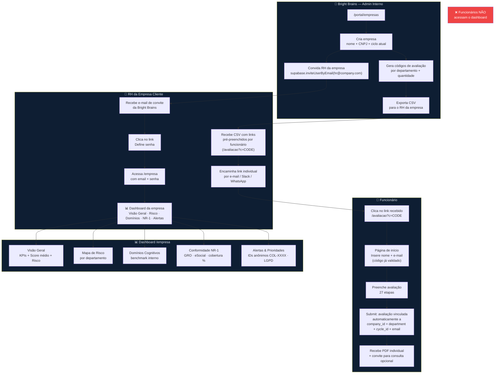

# Bright Precision B2B Company Dashboard — Strategy

**Version:** 1.3
**Date:** 17 Mar 2026
**Author:** Oliver + AI
**Status:** Strategy Draft — Refine before implementation detail

---

> **Product #2 turns Bright Precision from a B2C clinical tool into a B2B SaaS. Companies pay for their employees to be assessed, then log in to a dedicated dashboard showing aggregated, anonymized cognitive health data for their workforce — NR-1 compliance status, department risk maps, burnout indices, and priority alerts. The entire architecture reuses the existing Next.js + Supabase stack — no new infrastructure.**

---

## 1. The Problem

Today, all assessment data lives in `mental_health_evaluations` with no concept of employer or company. When a company client pays for 300 employee assessments:

- There is no way to link those evaluations to that company
- There is no way for the company to see aggregated data about their workforce
- The only output is individual PDF reports sent by the Bright Brains team manually
- To comply with NR-1, companies need documented proof of GRO and aggregated risk reporting — they can't get this from individual PDFs
- Without a self-service dashboard, Bright Brains must manually compile reports, which doesn't scale past a few clients

---

## 2. Current State Analysis

### What Exists Today

| Asset | Status | Details |
|-------|--------|---------|
| `mental_health_evaluations` table | ✅ Live | 86-field form data, scores, report_markdown, reviewer_status — but no company_id |
| `avaliacao_codigo` table | ✅ Live | Patient access codes — no company linkage |
| Doctor portal auth pattern | ✅ Live | `httpOnly` cookie, code-based gate — reusable for B2B |
| Assessment submit pipeline | ✅ Live | Submission stores evaluation; code lookup happens before form |
| Clinical scale scores | ✅ Live | `scores` jsonb has PHQ-9, GAD-7, MBI (burnout), PSS-10, etc. |
| HTML prototype | ✅ Built | Full UI mockup at `claude_artifact/new_products/2.1_b2b_dashboard/bright_precision_dashboard.html` |

### What's Missing

- ❌ `company_id` on evaluations — no way to group by company
- ❌ `department` on evaluations — no way to break down by team
- ❌ `companies` table — no company entity exists
- ❌ `assessment_cycles` table — no concept of semiannual cycles
- ❌ `cycle_id` on evaluations — evaluations not grouped by cycle
- ❌ `company_users` table — no way to link a Supabase Auth user to a company
- ❌ Company-tagged assessment codes — no stamping of evaluations to a company at submit time
- ❌ Aggregation API layer — no endpoints that compute org-level KPIs
- ❌ B2B dashboard frontend — no HR-facing company portal exists
- ❌ Proper authentication — Supabase Auth not yet used anywhere in the app
- ❌ Admin tools — no way to create companies, invite HR contacts, or manage cycles

---

## 3. The Vision / Solution

1. **One Supabase Auth account per company — created and invited by Bright Brains.** No self-signup. Bright Brains creates the company in the admin panel, then sends an invite email to the HR contact via `supabase.auth.admin.inviteUserByEmail()`. HR clicks the link, sets a password, done. Clean, controlled, zero risk of unauthorized access.
2. **Only HR accesses the dashboard — employees never do.** The B2B portal is exclusively for the HR/RH contact at the company. Individual employees receive a personalized PDF summary + an invitation to book an optional clinical consultation. They have no login, no portal access.
3. **Assessment via shareable links — employees never type a code.** Bright Brains generates per-employee (or per-batch) access codes tagged to a company + department + cycle. The CSV given to HR now contains a ready-to-share **URL** (`/avaliacao?c=CODE`), not a raw code. Employees click the link, land on a lightweight pre-registration page, enter their **email + name**, and proceed directly to the assessment — code is already validated, no typing required. The email is captured upfront and linked to the company, giving Bright Brains a completion-tracking hook before the 27-step form is submitted. On submit, the evaluation is stamped with `company_id` + `department` + `cycle_id` + `employee_email` automatically.
4. **Evaluations grouped into semiannual cycles.** Each company has assessment cycles (e.g., Jan–Jun 2026, Jul–Dec 2026). Evaluations are tagged to a cycle at submit time. HR can view current cycle or switch to previous ones.
5. **No external benchmark data for MVP.** The prototype shows "benchmark setor tech: 64.1" — this is aspirational. For MVP, the benchmark fields show "–" or "em construção" until Bright Brains has enough internal sample to compute meaningful benchmarks. No third-party data source needed.
6. **Anonymized by design.** The dashboard never exposes names, CPFs, or emails. Every employee renders as a pseudonymous ID (`COL-XXXX`). Complies with LGPD.
7. **Holdings are flat for MVP.** Subsidiaries are registered as separate companies (each gets their own HR login) OR as departments within a single company. No hierarchical data model needed now.
8. **NR-1 is the primary sales driver.** The Conformidade NR-1 tab is the legal reason companies buy this. Design around GRO status, eSocial tracking, coverage %, and the compliance checklist.

---

## 4. The System (High Level)

```
┌─────────────────────────────────────────────────────────────────────────────┐
│                          BRIGHT PRECISION B2B                                │
├──────────────────────────┬───────────────────────┬──────────────────────────┤
│                          │                       │                          │
│  COMPANY DASHBOARD       │  PATIENT ASSESSMENT   │  INTERNAL ADMIN          │
│  (routes)/empresa        │  (routes)/avaliacao   │  (routes)/portal/empresas│
│                          │                       │                          │
│  ┌────────────────────┐  │  ┌─────────────────┐  │  ┌────────────────────┐  │
│  │ Supabase Auth      │  │  │ Access Code     │  │  │ Company Manager    │  │
│  │ Login / Signup     │  │  │ Gate (existing) │  │  │ Create company     │  │
│  │ email + password   │  │  │                 │  │  │ Set domains        │  │
│  └────────┬───────────┘  │  └────────┬────────┘  │  │ Generate codes     │  │
│           │ domain       │           │           │  └────────────────────┘  │
│           │ match        │           │ stamps    │                          │
│           ▼              │           ▼           │                          │
│  ┌────────────────────┐  │  ┌─────────────────┐  │                          │
│  │ Dashboard          │  │  │ Evaluation      │  │                          │
│  │ ┌────────────────┐ │  │  │ + company_id    │  │                          │
│  │ │ Visão Geral    │ │  │  │ + department    │  │                          │
│  │ ├────────────────┤ │  │  └─────────────────┘  │                          │
│  │ │ Mapa de Risco  │ │  │                       │                          │
│  │ ├────────────────┤ │  │                       │                          │
│  │ │ Dom. Cognitivos│ │  │                       │                          │
│  │ ├────────────────┤ │  │                       │                          │
│  │ │ Conform. NR-1  │ │  │                       │                          │
│  │ ├────────────────┤ │  │                       │                          │
│  │ │ Alertas        │ │  │                       │                          │
│  │ └────────────────┘ │  │                       │                          │
│  └────────┬───────────┘  │                       │                          │
└───────────┼──────────────┴───────────────────────┴──────────────────────────┘
            │
            ▼
┌───────────────────────────────────────────────────────────────────────────────┐
│                             NEXT.JS API ROUTES                                │
│  /api/b2b/[companyId]/overview       /api/b2b/[companyId]/departments         │
│  /api/b2b/[companyId]/domains        /api/b2b/[companyId]/compliance          │
│  /api/b2b/[companyId]/alerts         /api/portal/companies (admin CRUD)       │
│  Auth: Supabase JWT (all b2b routes) via supabase.auth.getUser()              │
└───────────────────────────────────────────────────────────────────────────────┘
            │
            ▼
┌───────────────────────────────────────────────────────────────────────────────┐
│                                  SUPABASE                                     │
│                                                                               │
│  auth.users (built-in)     companies                  company_users           │
│  ├── id (uuid)             ├── id (uuid)              ├── user_id → auth.users│
│  ├── email                 ├── name                   ├── company_id          │
│  └── ...                   ├── cnpj                   └── role (viewer/admin) │
│                            ├── allowed_domains text[]                         │
│                            ├── active                                         │
│                            └── created_at                                     │
│                                                                               │
│  company_access_codes                mental_health_evaluations (EXTENDED)     │
│  ├── id (uuid)                       ├── ... (existing 30+ columns)           │
│  ├── company_id → companies          ├── company_id → companies (NEW)         │
│  ├── department                      └── employee_department (NEW)            │
│  ├── code (unique)                                                            │
│  ├── active, uses_count                                                       │
│  └── created_at                                                               │
└───────────────────────────────────────────────────────────────────────────────┘
```

---

## 4.1 Flow Diagram (Mermaid)



---

## 5. The Complete Pipeline

### 5.1 Company Onboarding (Admin Flow — Bright Brains Internal)

```
Doctor Portal → /portal/empresas → "Nova Empresa"
       │
       ▼
POST /api/portal/companies
  └─ body: { name, cnpj, contact_email }
  └─ creates row in `companies`
  └─ creates row in `assessment_cycles` (current semiannual cycle)
       │
       ▼
POST /api/portal/companies/[id]/invite-hr
  └─ body: { email: "rh@quality.com.br" }
  └─ calls supabase.auth.admin.inviteUserByEmail(email)
  └─ creates company_users row: { user_id (pending), company_id, role: 'viewer' }
  └─ HR receives email → clicks link → sets password → can log in immediately
       │
       ▼
POST /api/portal/companies/[id]/codes
  └─ body: { department: "Engenharia", count: 50, employee_emails?: string[] }
  └─ generates 50 unique codes in `company_access_codes`
  └─ each code has a `shareable_url`: https://app.com/avaliacao?c={code}
       │
       ▼
GET /api/portal/companies/[id]/codes → export CSV
  └─ CSV columns: code | department | employee_email (if pre-assigned) | shareable_url
  └─ Bright Brains sends CSV to company HR
  └─ HR distributes the LINK (not the raw code) to each employee
     via e-mail, Slack, WhatsApp, or HR system — their choice
```

### 5.2 Employee Assessment — Link-Based Entry + Email Pre-Registration

The employee never types a code. They click a link, identify themselves, and proceed directly to the form.

```
HR forwards link: https://app.com/avaliacao?c=ENG-0042
       │
       ▼
GET /avaliacao?c=ENG-0042
  └─ page detects ?c= param on load
  └─ calls POST /api/assessment/validate-code { code: "ENG-0042" }
  └─ if company code found:
       │  stores { company_id, department, cycle_id, code_id } in sessionStorage
       │  renders PRE-REGISTRATION STEP (instead of jumping straight to form)
       ▼
Pre-registration step (lightweight — same /avaliacao page, step 0)
  └─ fields: Nome completo + E-mail
  └─ on submit: POST /api/assessment/pre-register
       │  body: { code_id, name, email }
       │  writes: company_access_codes.employee_email = email (if not already set)
       │  writes: company_access_codes.started_at = now()
       │  returns: session token stored in sessionStorage
       ▼
Employee proceeds through 27-step assessment
  └─ name + email are PRE-FILLED from the pre-registration step
       │
       ▼
POST /api/assessment/submit
  └─ reads company_id, employee_department, cycle_id, employee_email from session
  └─ inserts evaluation WITH company_id + employee_department + cycle_id + patient_email stamped
  └─ marks company_access_codes.used_at = now(), used_by_evaluation_id = eval.id
  └─ existing pipeline continues (report generation, PDF, notification — unchanged)
```

**Key decisions:**
- Two code tables — open patient codes (`avaliacao_codigo`) and B2B codes (`company_access_codes`). Both still work through the same `/avaliacao` route.
- Pre-registration is only shown when a **company code** is detected. Open patient codes skip straight to the form as before — no regression.
- Email is captured before the form, not after — Bright Brains can track completion rate (`started_at` but no `used_by_evaluation_id`) and follow up with employees who started but didn't finish.
- The code in the URL is the single source of truth. If HR wants to pre-assign codes to specific employees, the CSV has an `employee_email` column they can fill before distributing.

### 5.3 HR Dashboard Login (Supabase Auth — Invite Only)

```
HR receives invite email from Bright Brains (Supabase magic link)
       │
       ▼
Clicks link → /empresa/login → sets password
       │
       ▼
Supabase Auth creates session → JWT stored in browser
Supabase trigger (or /api/b2b/auth/on-invite-accepted) confirms company_users row
       │
       ▼
HR visits /empresa → layout.tsx checks session → resolves company_id via company_users
       │
       ▼
GET /api/b2b/me  →  { company_id, company_name, current_cycle }
       │
       ▼
GET /api/b2b/[companyId]/overview?cycle=[cycleId]
  └─ supabase.auth.getUser() → verifies JWT
  └─ checks company_users: requester's company_id == requested companyId
  └─ queries mental_health_evaluations WHERE company_id = :id AND cycle_id = :cycleId
  └─ returns aggregated KPIs (NO PII — no names, CPFs, emails)
       │
       ▼
Dashboard renders 5 tabs with Chart.js
HR can switch between cycles (current vs. previous semesters)
```

---

## 6. Architecture & Code Location

### Directory Structure

The project uses `frontend/app/[locale]/` as the base. The public website lives in `[locale]/(routes)/`. Feature sections with their own layout (`avaliacao`, `portal`) sit directly under `[locale]/` — **`empresa` follows this same pattern**.

Auth callbacks from Mindless Academy were copied to `frontend/auth/` (at the root of the app folder, outside `[locale]/`).

```
frontend/
├── app/
│   ├── [locale]/
│   │   ├── (routes)/                         # Public website (Header + Footer layout) — UNCHANGED
│   │   │   ├── layout.tsx
│   │   │   ├── [[...slug]]/
│   │   │   └── ...
│   │   │
│   │   ├── avaliacao/                        # Assessment portal — UNCHANGED, own dark layout
│   │   │
│   │   ├── portal/                           # Clinical portal — UNCHANGED, own dark layout
│   │   │
│   │   └── empresa/                          # B2B HR dashboard — NEW, own layout (same pattern as avaliacao/portal)
│   │       ├── layout.tsx                    # Session guard: checks Supabase Auth + company_users membership
│   │       ├── page.tsx                      # Root redirect: session → /empresa/dashboard, else → /empresa/login
│   │       ├── login/
│   │       │   └── page.tsx                  # HR login (email + password, no OAuth providers)
│   │       └── dashboard/
│   │           └── page.tsx                  # Protected dashboard shell (5 tabs)
│   │
│   ├── auth/                                 # Supabase Auth callbacks — ported from Mindless Academy
│   │   ├── callback/route.ts                 # MODIFY: role-check → company_users → /empresa/dashboard
│   │   ├── confirm/route.ts                  # MODIFY: invite confirmation → /empresa/dashboard
│   │   ├── signin/page.tsx                   # MODIFY: redirect → /empresa/login
│   │   ├── signup/page.tsx                   # MODIFY: disable self-signup, show invite-only message
│   │   ├── signout/page.tsx                  # MODIFY: redirect → /empresa/login
│   │   ├── update-password/page.tsx          # MODIFY: post-update redirect → /empresa/login
│   │   ├── auth.interface.ts                 # MODIFY: remove Mindless types, add 'company_hr'
│   │   └── services_and_hooks/
│   │       ├── authService.ts                # MODIFY: update hardcoded redirect paths
│   │       ├── useB2BCompanyUser.ts          # NEW: TanStack Query hook → GET /api/b2b/me
│   │       └── useUserRoles.ts               # DELETE — replaced by useB2BCompanyUser.ts
│   │
│   └── api/
│       ├── b2b/
│       │   ├── me/route.ts                   # NEW: { company_id, company_name, cycles[], current_cycle }
│       │   └── [companyId]/
│       │       ├── overview/route.ts         # KPIs + risk distribution
│       │       ├── departments/route.ts      # per-dept breakdown + trend vs previous cycle
│       │       ├── domains/route.ts          # 13 cognitive domain averages
│       │       ├── compliance/route.ts       # NR-1 status, GRO dates, coverage %
│       │       └── alerts/route.ts           # anonymized risk alerts (COL-XXXX, no PII)
│       ├── portal/
│       │   └── companies/
│       │       ├── route.ts                  # GET list, POST create company
│       │       └── [id]/
│       │           ├── route.ts              # GET detail, PATCH, DELETE
│       │           ├── invite-hr/route.ts    # POST → supabase.auth.admin.inviteUserByEmail()
│       │           ├── codes/route.ts        # POST generate codes, GET list + CSV export
│       │           └── cycles/route.ts       # POST create new semiannual cycle
│       └── assessment/
│           ├── validate-code/route.ts        # MODIFY: also checks company_access_codes
│           └── pre-register/route.ts         # NEW: writes employee_email + started_at
│
├── features/
│   ├── b2b-dashboard/
│   │   ├── components/
│   │   │   ├── B2BLoginComponent.tsx         # email + password form (Supabase Auth, no providers)
│   │   │   ├── B2BDashboardComponent.tsx     # tab router + header
│   │   │   ├── B2BHeaderComponent.tsx        # company name, cycle selector, NR-1 badge
│   │   │   ├── B2BKpiRowComponent.tsx        # 5 KPI summary cards
│   │   │   └── tabs/
│   │   │       ├── B2BOverviewTab.tsx        # Visão Geral
│   │   │       ├── B2BRiskMapTab.tsx         # Mapa de Risco
│   │   │       ├── B2BDomainsTab.tsx         # Domínios Cognitivos
│   │   │       ├── B2BComplianceTab.tsx      # Conformidade NR-1
│   │   │       └── B2BAlertsTab.tsx          # Alertas & Prioridades
│   │   ├── hooks/
│   │   │   ├── useB2BSession.ts              # Supabase Auth session + company_id resolution
│   │   │   ├── useB2BOverview.ts             # TanStack Query → /api/b2b/[id]/overview
│   │   │   ├── useB2BDepartments.ts
│   │   │   ├── useB2BDomains.ts
│   │   │   ├── useB2BCompliance.ts
│   │   │   └── useB2BAlerts.ts
│   │   └── b2b-dashboard.interface.ts        # all B2B TypeScript types
│   │
│   └── portal/
│       └── components/
│           ├── CompanyManagerComponent.tsx       # admin: list + create companies
│           └── CompanyCodeGeneratorComponent.tsx # generate codes + export CSV with shareable URLs
```

---

## 7. Database Schema

```sql
-- New table: companies
CREATE TABLE companies (
  id               uuid PRIMARY KEY DEFAULT gen_random_uuid(),
  name             text NOT NULL,
  cnpj             text UNIQUE,
  contact_email    text,                          -- HR contact email (invited via Supabase)
  active           boolean NOT NULL DEFAULT true,
  gro_issued_at    timestamptz,                   -- NR-1: when GRO was issued (set manually by Bright Brains)
  gro_valid_until  timestamptz,                   -- NR-1: GRO expiry (typically +12 months)
  created_at       timestamptz NOT NULL DEFAULT now()
);

-- New table: assessment_cycles (semiannual periods per company)
CREATE TABLE assessment_cycles (
  id           uuid PRIMARY KEY DEFAULT gen_random_uuid(),
  company_id   uuid NOT NULL REFERENCES companies(id) ON DELETE CASCADE,
  label        text NOT NULL,                     -- e.g. "Jan–Jun 2026"
  starts_at    date NOT NULL,                     -- e.g. 2026-01-01
  ends_at      date NOT NULL,                     -- e.g. 2026-06-30
  is_current   boolean NOT NULL DEFAULT false,    -- only one active per company at a time
  created_at   timestamptz NOT NULL DEFAULT now()
);

CREATE INDEX cycles_company_idx ON assessment_cycles(company_id);
CREATE UNIQUE INDEX cycles_one_current ON assessment_cycles(company_id) WHERE is_current = true;

-- New table: company_users (links Supabase Auth invited users → companies)
CREATE TABLE company_users (
  id           uuid PRIMARY KEY DEFAULT gen_random_uuid(),
  user_id      uuid NOT NULL REFERENCES auth.users(id) ON DELETE CASCADE,
  company_id   uuid NOT NULL REFERENCES companies(id) ON DELETE CASCADE,
  role         text NOT NULL DEFAULT 'viewer',    -- 'viewer' only for MVP
  created_at   timestamptz NOT NULL DEFAULT now(),
  UNIQUE(user_id, company_id)
);

CREATE INDEX company_users_user_idx    ON company_users(user_id);
CREATE INDEX company_users_company_idx ON company_users(company_id);

-- New table: company_access_codes (employee assessment codes distributed by HR)
CREATE TABLE company_access_codes (
  id                      uuid PRIMARY KEY DEFAULT gen_random_uuid(),
  company_id              uuid NOT NULL REFERENCES companies(id) ON DELETE CASCADE,
  cycle_id                uuid NOT NULL REFERENCES assessment_cycles(id),
  code                    text UNIQUE NOT NULL,
  department              text,                  -- e.g. "Engenharia", "RH & Adm"
  -- Pre-assignment (optional): HR can pre-assign a code to a specific employee email
  employee_email          text,                  -- set by admin at generation OR by pre-registration step
  -- Completion tracking
  started_at              timestamptz,           -- set when employee hits the pre-registration step
  used_at                 timestamptz,           -- set on assessment submit
  used_by_evaluation_id   uuid REFERENCES mental_health_evaluations(id),
  active                  boolean NOT NULL DEFAULT true,
  created_at              timestamptz NOT NULL DEFAULT now()
);

CREATE INDEX company_access_codes_code_idx    ON company_access_codes(code);
CREATE INDEX company_access_codes_company_idx ON company_access_codes(company_id);

-- Extend mental_health_evaluations (3 new columns)
ALTER TABLE mental_health_evaluations
  ADD COLUMN company_id          uuid REFERENCES companies(id),
  ADD COLUMN employee_department text,            -- copied from access code at submit time
  ADD COLUMN cycle_id            uuid REFERENCES assessment_cycles(id);

CREATE INDEX mhe_company_id_idx ON mental_health_evaluations(company_id);
CREATE INDEX mhe_cycle_id_idx   ON mental_health_evaluations(cycle_id);

-- RLS: all B2B API routes use the service role key server-side.
-- company_users gets RLS for safety:
ALTER TABLE company_users ENABLE ROW LEVEL SECURITY;
CREATE POLICY "Users see own company memberships"
  ON company_users FOR SELECT USING (auth.uid() = user_id);
```

---

## 8. API Endpoints

### B2B Dashboard (HR-facing, invite-only)

| Method | Path | Auth | Description |
|--------|------|------|-------------|
| `GET` | `/api/b2b/me` | Supabase JWT | Returns `{ company_id, company_name, current_cycle, cycles[] }` |
| `GET` | `/api/b2b/[companyId]/overview` | Supabase JWT | KPIs: total assessed, avg score, risk dist, burnout index |
| `GET` | `/api/b2b/[companyId]/departments` | Supabase JWT | Per-dept: n, avg score, risk breakdown, trend vs previous cycle |
| `GET` | `/api/b2b/[companyId]/domains` | Supabase JWT | 13 cognitive domain averages (no external benchmark in MVP) |
| `GET` | `/api/b2b/[companyId]/compliance` | Supabase JWT | NR-1 checklist, GRO status/dates, coverage %, cycle timeline |
| `GET` | `/api/b2b/[companyId]/alerts` | Supabase JWT | Anonymized high/critical risk employees (COL-XXXX, never PII) |

All `?cycle=[cycleId]` query param supported. Defaults to current cycle.
All `/api/b2b/[companyId]/*` routes verify: `company_users.company_id == companyId` for the requester.

### Assessment Pre-Registration (public — no auth, code is the credential)

| Method | Path | Auth | Description |
|--------|------|------|-------------|
| `POST` | `/api/assessment/validate-code` | none | **Modified**: also checks `company_access_codes`. Returns `{ type: 'company' \| 'open', company_id?, department?, cycle_id?, code_id? }` |
| `POST` | `/api/assessment/pre-register` | none | Records `employee_email` + `started_at` on `company_access_codes`. Returns session token for form pre-fill. Only called for company codes. |

### Internal Admin (doctor portal extension)

| Method | Path | Auth | Description |
|--------|------|------|-------------|
| `GET` | `/api/portal/companies` | portal_session | List all companies |
| `POST` | `/api/portal/companies` | portal_session | Create company (name, CNPJ, contact_email) + auto-creates first cycle |
| `GET` | `/api/portal/companies/[id]` | portal_session | Company detail + evaluation count + code stats |
| `PATCH` | `/api/portal/companies/[id]` | portal_session | Update name, CNPJ, GRO dates, active |
| `POST` | `/api/portal/companies/[id]/invite-hr` | portal_session | Invite HR contact → `supabase.auth.admin.inviteUserByEmail()` |
| `POST` | `/api/portal/companies/[id]/codes` | portal_session | Generate batch of codes for a dept. Body: `{ department, count, employee_emails? }`. CSV response includes `shareable_url` column. |
| `GET` | `/api/portal/companies/[id]/codes` | portal_session | List codes with `started_at`, `used_at`, `employee_email` — completion rate visible |
| `POST` | `/api/portal/companies/[id]/cycles` | portal_session | Create new semiannual cycle (e.g. "Jul–Dez 2026") |

---

## 9. Score Aggregation Logic

The dashboard derives all its data from existing `scores` and `form_data` fields in `mental_health_evaluations`. No new AI processing is needed.

### Risk Level Classification (from `scores`)
```
Score < 45              → Crítico
Score 45–59             → Elevado  
Score 60–69             → Moderado
Score ≥ 70              → Baixo
```

The overall "score" is a weighted average of clinical scale results already computed at submission time.

### Burnout Index
Derived from `scores.mbi` (Maslach Burnout Inventory) — already collected.

### NR-1 Compliance Status
Computed from: `reviewer_status = 'approved'` count / total evaluations for company.  
GRO status: manually set flag on the `companies` table (`gro_issued_at`, `gro_valid_until`).

### Anonymization
Each employee gets a stable pseudonymous ID: `COL-{4-digit hash of evaluation UUID}`. Never stored — computed at query time. The raw `id` is never sent to the company client.

---

## 10. Integration Points

| Integration | File | Change Type |
|-------------|------|-------------|
| `validate-code` API | `app/api/assessment/validate-code/route.ts` | Modify: also check `company_access_codes`, return company context |
| `submit` API | `app/api/assessment/submit/route.ts` | Modify: write `company_id` + `employee_department` if present |
| Portal session middleware | `app/api/portal/validate-code/route.ts` | No change — B2B uses separate Supabase Auth |
| Doctor Portal nav | `features/portal/components/PortalHeaderComponent.tsx` | Add "Empresas" nav link → `/portal/empresas` |
| Supabase client config | `lib/supabase.ts` (new) | Create browser + server Supabase clients with Auth support |

---

## 11. Interface Mockups

Full prototype exists at: `claude_artifact/new_products/2.1_b2b_dashboard/bright_precision_dashboard.html`

The prototype is complete HTML/JS with Chart.js and demonstrates all 5 tabs with real mock data for 3 companies (Grupo Quality, Grupo Deal, Evertec Brasil). This is the exact visual target for implementation.

Key differences between prototype and final product:
- Data is live from Supabase (not hardcoded)
- Company selection is single (you see your own company, not all)
- Alerts use stable anonymized IDs (`COL-XXXX`) computed server-side

---

## 12. Implementation Phases

### Phase 0 — Database (Wave 0, ~4h)
- [ ] Create `companies` table with `allowed_domains text[]` and GRO fields
- [ ] Create `company_users` table (links `auth.users` → `companies`)
- [ ] Create `company_access_codes` table (employee assessment codes)
- [ ] Add `company_id` + `employee_department` to `mental_health_evaluations`
- [ ] Create all indexes + RLS policy on `company_users`

### Phase 1 — Assessment Stamping + Link-Based Entry (Wave 1, ~6h)
- [ ] Modify `validate-code`: also check `company_access_codes`; return `{ type, company_id, department, cycle_id, code_id }` in session
- [ ] When `type === 'company'`: render pre-registration step (name + email) before assessment starts
- [ ] Create `POST /api/assessment/pre-register`: writes `employee_email` + `started_at` on `company_access_codes` row
- [ ] Modify `submit` to write `company_id`, `employee_department`, `cycle_id`, `patient_email` when company code detected
- [ ] Mark `company_access_codes.used_at` + `used_by_evaluation_id` on successful submit
- [ ] CSV export from code generator includes `shareable_url` column

### Phase 2 — Auth Integration + Invite Flow (Wave 1 parallel, ~7h)

The Supabase Auth system was ported from Mindless Academy (`frontend/auth/`). The core Supabase plumbing (`authService.ts`, `authStore.ts`, `authProvider.tsx`, `useAuthHook.ts`) works as-is. The changes are surgical — redirects and role-resolution logic need to be adapted for bright-brains.

#### Files to MODIFY (already in project at `frontend/app/auth/`):

| File | Change | Scope |
|------|--------|-------|
| `app/auth/callback/route.ts` | Full rewrite of role-check logic. Remove: `admins`, `university_users`, `learners` table lookups. Replace with: `company_users` lookup → redirect to `/empresa/dashboard`. Keep: password recovery flow (`type=recovery` branch). | Full rewrite of the role section |
| `app/auth/confirm/route.ts` | Same as callback. Remove Mindless Academy table checks. Replace with: exchange code → get user → lookup `company_users` by `user_id` → redirect `/empresa/dashboard`. If not found → redirect `/empresa/login?error=unauthorized`. | Full rewrite |
| `app/auth/auth.interface.ts` | Remove `UserType: 'university_user' \| 'learner'`, add `'company_hr'`. Remove `Organization`, `EnrichedOrganization`, `SubscriptionStatus` (unused). Clean up comments. | Interface cleanup |
| `app/auth/services_and_hooks/useUserRoles.ts` | Remove file entirely. Replace with `useB2BCompanyUser.ts` (new file below). | Delete + replace |
| `app/auth/signout/page.tsx` | Update redirect paths: `/login` → `/empresa/login`. | 3 lines |
| `app/auth/signin/page.tsx` | Update redirect: `/login` → `/empresa/login`. | 1 line |
| `app/auth/signup/page.tsx` | Remove signup redirect. Show "Acesso via convite — verifique seu e-mail." No self-signup for B2B. | Replace content |
| `app/auth/services_and_hooks/authService.ts` | Update hardcoded paths: `/onboarding/basic-info` → `/empresa/dashboard`, `/login?logout=success` → `/empresa/login?logout=success`. | 2-3 path strings |
| `app/auth/update-password/page.tsx` | Update post-update redirect: `/login` → `/empresa/login`. | 1 line |

#### Files to CREATE:

| File | Purpose |
|------|---------|
| `app/auth/services_and_hooks/useB2BCompanyUser.ts` | TanStack Query hook. Calls `GET /api/b2b/me`. Returns `{ company_id, company_name, current_cycle, cycles[], isCompanyUser }`. Used by dashboard layout and all B2B tabs. |
| `app/[locale]/empresa/login/page.tsx` | Company HR login page. Uses `AuthForm` with `view='sign_in'`, `hideProviders=true` (no Google OAuth). Post-login redirects to `/empresa/dashboard`. |
| `app/[locale]/empresa/dashboard/page.tsx` | Protected dashboard shell. Renders `B2BDashboardComponent` with all 5 tabs. |
| `app/[locale]/empresa/page.tsx` | Root redirect: session present → `/empresa/dashboard`, no session → `/empresa/login`. |
| `app/[locale]/empresa/layout.tsx` | Session guard layout for all `/empresa/*` routes. Checks `useAuthHook().isAuthenticated` + `useB2BCompanyUser().isCompanyUser`. If not authenticated → `/empresa/login`. If authenticated but not in `company_users` → `/empresa/login?error=unauthorized`. |
| `app/api/b2b/me/route.ts` | `GET`. `supabase.auth.getUser()` → lookup `company_users` JOIN `companies` → return `{ company_id, company_name, role, cycles[], current_cycle }`. 401 if no session or not in `company_users`. |
| `app/api/auth/signout/route.ts` | `POST`. Calls `supabase.auth.signOut()`. Check if it already exists, create if not. |

#### Files KEPT AS-IS (no changes needed, all under `app/auth/`):

- `services_and_hooks/authService.ts` — all Supabase Auth methods (signIn, signOut, resetPassword, updatePassword) are generic ✅
- `services_and_hooks/authStore.ts` — Zustand store, subscription/organizations fields are unused but harmless ✅
- `components/authProvider.tsx` — generic Supabase auth event listener ✅
- `services_and_hooks/useAuthHook.ts` — reads session/profile from store. Profile query hits `user_profiles` (doesn't exist in bright-brains) but returns null gracefully via `maybeSingle()` ✅
- `services_and_hooks/useAuthQueryHook.ts` — generic query wrapper ✅
- `components/ConditionalAuthProvider.tsx` — ✅
- `verify-email/page.tsx` — ✅
- `pending-confirmation/page.tsx` — ✅
- `authDiagnostics.tsx` — dev utility ✅

#### Supabase project setup (one-time, ~30 min):
- [ ] Enable email provider in Supabase Auth dashboard
- [ ] Set site URL to production domain
- [ ] Add `/auth/callback` and `/auth/confirm` to Supabase redirect allow-list (routes live at `app/auth/callback` and `app/auth/confirm` — no locale prefix)
- [ ] Configure email templates (invite email, reset password email) with Bright Brains branding

### Phase 3 — Aggregation APIs (Wave 2, ~10h)
- [ ] `GET /api/b2b/[companyId]/overview?cycle=` — KPIs + risk distribution
- [ ] `GET /api/b2b/[companyId]/departments?cycle=` — per-dept breakdown + trend vs previous cycle
- [ ] `GET /api/b2b/[companyId]/domains?cycle=` — 13 domain averages (no external benchmark)
- [ ] `GET /api/b2b/[companyId]/compliance?cycle=` — NR-1 status, GRO dates, coverage %
- [ ] `GET /api/b2b/[companyId]/alerts?cycle=` — anonymized alerts (COL-XXXX, no PII)
- [ ] All routes: `getB2BUser(req)` + company ownership check

### Phase 4 — B2B Dashboard Frontend (Wave 2 parallel, ~16h)
- [ ] `B2BLoginComponent` — email/password form (Supabase Auth)
- [ ] Dashboard shell: header (company name, cycle selector, NR-1 badge), KPI row, tab nav
- [ ] Cycle selector component — dropdown switches `?cycle=` param across all tabs
- [ ] Tab 1: Visão Geral (trend chart + donut + dept risk bars)
- [ ] Tab 2: Mapa de Risco (dept table + hierarchy chart + risk factor bars)
- [ ] Tab 3: Domínios Cognitivos (bar chart + critical/strong domains — no benchmark in MVP)
- [ ] Tab 4: Conformidade NR-1 (checklist + timeline + GRO status cards)
- [ ] Tab 5: Alertas & Prioridades (risk cards with COL-XXXX + action plan + LGPD disclaimer)
- [ ] TanStack Query hooks for all 5 endpoints with cycle param
- [ ] `useB2BSession` hook — Supabase Auth session + company_id resolution

### Phase 5 — Admin Company Management (Wave 3, ~7h)
- [ ] Company list page (`/portal/empresas`) + stats (evaluations, last activity)
- [ ] Create company form (name, CNPJ, contact_email) + auto-creates first cycle
- [ ] Invite HR button → calls `/invite-hr` → confirmation toast
- [ ] Employee code batch generator (dept + quantity → downloadable CSV)
- [ ] Company detail: code usage stats, GRO date fields, cycle management
- [ ] Create new cycle form (label + start/end dates → sets as current)

---

## 13. Cost Estimate for Client

| Component | Hours | Notes |
|-----------|-------|-------|
| Database schema + migrations | 4–5h | 4 new tables + 3 new columns on evaluations |
| Assessment stamping (submit pipeline) | 3–4h | Low risk — additive change only |
| Supabase Auth + invite flow | 4–5h | Enable Auth, invite-hr API, session guard |
| B2B aggregation APIs (5 endpoints + cycle param) | 8–12h | Core backend logic, anonymization, cycle filtering |
| B2B dashboard frontend (5 tabs + cycle selector) | 14–20h | Chart.js, Supabase Auth login, TanStack Query |
| Admin company management + cycle management | 6–8h | Internal portal extension |
| Integration testing + polish | 4–6h | End-to-end flows, edge cases |
| **Total estimate** | **43–60h** | |

At a standard SaaS dev rate (€80–120/h), this is roughly **€3,400–€7,200**.
With AI-assisted development (current workflow), the actual calendar time is **1–2 weeks**.

---

## 14. Decisões Confirmadas pelo Cliente (17/03/2026)

| # | Pergunta | Resposta | Impacto na Arquitetura |
|---|----------|----------|------------------------|
| 1 | **Quem acessa o dashboard?** | Apenas o RH da empresa, não os funcionários | Supabase Auth com invite only — um usuário por empresa |
| 2 | **Holdings/subsidiárias?** | MVP: não se preocupar. Subsidiárias = empresas separadas ou departamentos | Estrutura flat confirmada — sem hierarquia de empresas |
| 3 | **O funcionário vê dados individuais?** | Não. Recebe PDF individual + convite para consulta | Zero acesso de funcionários ao portal B2B |
| 4 | **Quem gerencia acessos?** | Apenas o RH, gerenciado pela Bright Brains | Um `company_users` por empresa, criado via invite |
| 5 | **Dados de benchmark?** | Apenas da própria base interna quando houver massa crítica | MVP: campo de benchmark mostra "–" ou "em construção" |
| 6 | **Ciclos de avaliação?** | Ciclos semestrais | Tabela `assessment_cycles` + `cycle_id` em tudo |

---

## 15. Onboarding Interno — Fluxo Definitivo

Todo o setup fica do lado da Bright Brains. O RH da empresa cliente nunca cria nada — recebe um convite por e-mail e um CSV.

```
Portal Médico (/portal/empresas)
       │
       ▼
1. Bright Brains cria a empresa
   - Nome, CNPJ, e-mail do RH
   - Sistema cria o primeiro ciclo semestral automaticamente (ex: "Jan–Jun 2026")

       │
       ▼
2. Bright Brains convida o RH
   - Clica em "Convidar RH" → sistema chama supabase.auth.admin.inviteUserByEmail()
   - RH recebe e-mail → clica no link → define senha → já tem acesso ao dashboard

       │
       ▼
3. Bright Brains gera os códigos de avaliação
   - Informa: departamento + quantidade (ex: "Engenharia → 50 códigos")
   - Opcionalmente: cola uma lista de e-mails para pré-atribuição (1 código por funcionário)
   - Sistema gera os códigos vinculados à empresa + ciclo atual
   - CSV exportado tem as colunas: código | departamento | e-mail (se pré-atribuído) | link
     ex: ENG-0042 | Engenharia | joao@quality.com.br | https://app.com/avaliacao?c=ENG-0042
   - Bright Brains (ou o próprio RH) dispara os links individualmente

       │
       ▼
4. Funcionário recebe o link e inicia a avaliação
   - Clica no link — código já está validado, sem necessidade de digitar
   - Página de início exibe: "Olá! Antes de começar, confirme seu nome e e-mail."
   - Nome + e-mail são salvos em company_access_codes.employee_email + started_at
   - Esses campos ficam pré-preenchidos no formulário de avaliação
   - Ao submeter: avaliação vinculada automaticamente a company_id + department + cycle_id
   - Funcionário não sabe que está em contexto B2B
   - Bright Brains pode acompanhar quem iniciou mas não finalizou (started_at sem used_at)

       │
       ▼
5. RH acessa /empresa → login com email + senha
   - Vê o dashboard consolidado do ciclo atual
   - Pode navegar por ciclos anteriores
   - Nunca vê avaliações individuais ou dados nominais
```

---

## 16. Perguntas Ainda em Aberto

1. **Status GRO (NR-1)** — O campo `gro_emitido_em` / `gro_valido_ate` é preenchido manualmente pela Bright Brains no admin, ou calculado automaticamente quando a cobertura de avaliações aprovadas atingir um threshold (ex: ≥75%)?

2. **Exportar relatório do dashboard** — Para o MVP: browser print/PDF (simples, zero dev) ou PDF gerado no servidor com branding Bright Brains (mais trabalho)? Recomendação: browser print para MVP.
